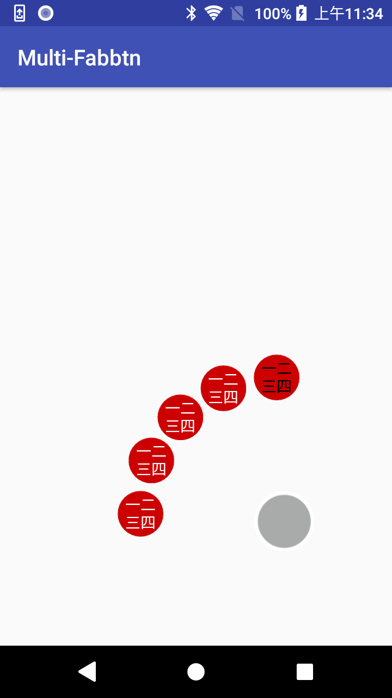

# Multi-fabbtn-plugin
A multi-FloatingActionButton plugin for Android Applications.

## Download

Download this by Gradle

in Project/build.gradle add this in allprojects{reposities{}}

> maven { url 'https://jitpack.io' }

in Project/module/build.gradle add this in dependencies{}

> implementation 'com.github.ray360310:multi_fabbtn_plugin:-SNAPSHOT'

## Usage

First, add MultiFabBtn to your xml view

    <com.rayhung.multi_fabbtn_plugin.MultiFabBtn
        android:id="@+id/mfab"
        android:layout_width="match_parent"
        android:layout_height="match_parent"
        app:layout_constraintBottom_toBottomOf="parent"
        app:layout_constraintEnd_toEndOf="parent"
        app:layout_constraintStart_toStartOf="parent"
        app:layout_constraintTop_toTopOf="parent">
        
Then in your Activity/Fragment, implement MultiFabBtnCallback to active FloatingActionButton onClick event.

Add some Function:

        //must add
        mfab.setCallbackListener(this)
        //optional
        mfab.setMultiFabBtnWidth(42)
        mfab.setfabBtnDistance(250f)
        
        //custom Fab function
        mfab.setFabsTextSize(14f)
        mfab.setFabsTextColor(R.color.Gray)
        
        //each fab setting
        mfab.setMainFabBackground(android.R.color.black)
        mfab.setMainFabImageResource(R.mipmap.ic_launcher_round)
        mfab.setMainFabElevation(0f)
        
        mfab.setFab01Background(android.R.color.holo_orange_light)
        mfab.setFab01ImageResource(R.mipmap.ic_launcher_round)
        mfab.setFab01Elevation(0f)
        mfab.setFab01Text("Hello")
        
        mfab.setFab02Background(android.R.color.holo_green_light)
        mfab.setFab02ImageResource(R.mipmap.ic_launcher_round)
        mfab.setFab02Elevation(0f)
        mfab.setFab02Text("Hello")
        
        mfab.setFab03Background(android.R.color.holo_green_dark)
        mfab.setFab03ImageResource(R.mipmap.ic_launcher_round)
        mfab.setFab03Elevation(0f)
        mfab.setFab03Text("Hello")
        
        mfab.setFab04Background(android.R.color.holo_blue_dark)
        mfab.setFab04ImageResource(R.mipmap.ic_launcher_round)
        mfab.setFab04Elevation(0f)
        mfab.setFab04Text("Hello")
        
        mfab.setFab05Background(android.R.color.holo_blue_bright)
        mfab.setFab05ImageResource(R.mipmap.ic_launcher_round)
        mfab.setFab05Elevation(0f)
        mfab.setFab05Text("Hello")
        
        //If you want to setup each text color,use below functions
        mfab.setFab01TextColor(R.color.Red) //change number 01~05
        

Done. 

## Usage Sample Pics

Initial

Touch the main fab

Move the main fab to change position

2018/09/18 Add TextView to show

